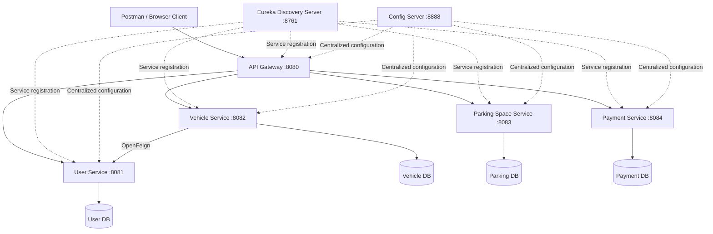

# 🚗 Smart Parking Management System (SPMS)

<p align="center">
  A cloud-native smart parking platform developed with Spring Boot and Spring Cloud using a scalable microservices architecture.
</p>

<p align="center">
  
  
  
  
</p>

## 📌 Overview

The **Smart Parking Management System (SPMS)** is a multi-module microservices application designed to manage users, vehicles, parking spaces, and payments through independently deployable services.

The system uses **Eureka Service Discovery**, **Spring Cloud Config**, **Spring Cloud Gateway**, and **OpenFeign** for service registration, centralized configuration, routing, load balancing, and inter-service communication. Each business service follows the **database-per-service** pattern and uses an isolated H2 in-memory database.

## ✨ Key Features

- User registration, login, profile management, and booking history
- Vehicle registration and profile updates
- Vehicle entry and exit simulation
- Parking-space search, reservation, release, and status management
- Simulated IoT sensor status updates
- Mock payment processing and card validation
- Digital payment receipt generation
- Centralized API routing through Spring Cloud Gateway
- Service registration and discovery with Netflix Eureka
- Centralized configuration management
- Inter-service communication using OpenFeign
- Independent database for each business service
- Preloaded seed data for convenient testing
- Ready-to-import Postman API collection

## 🏗️ Architecture



## 🧩 Service Registry and Port Allocation

| Service | Port | Description | Database |
| --- | ---: | --- | --- |
| `discovery-server` | `8761` | Eureka service registry and discovery | N/A |
| `config-server` | `8888` | Centralized configuration using the native profile | Classpath configurations |
| `api-gateway` | `8080` | Centralized routing and load balancing | N/A |
| `user-service` | `8081` | Registration, login, profiles, and booking history | `jdbc:h2:mem:user_db` |
| `vehicle-service` | `8082` | Vehicle registration, updates, entry, and exit | `jdbc:h2:mem:vehicle_db` |
| `parking-space-service` | `8083` | Space allocation, status management, and IoT updates | `jdbc:h2:mem:parking_db` |
| `payment-service` | `8084` | Payment processing, validation, and receipts | `jdbc:h2:mem:payment_db` |

## 🛠️ Technology Stack

| Area | Technologies |
| --- | --- |
| Language | Java 17 |
| Core Framework | Spring Boot 3.2.5 |
| Cloud Platform | Spring Cloud 2023.0.1 |
| Service Discovery | Netflix Eureka Server and Client |
| Configuration | Spring Cloud Config Server |
| Gateway | Spring Cloud Gateway |
| Service Communication | OpenFeign |
| Persistence | Spring Data JPA |
| Database | H2 in-memory databases |
| Validation | Jakarta Bean Validation |
| Utilities | Lombok |
| Build Tool | Maven |
| API Testing | Postman Collection v2.1 |

## 📁 Project Structure

```text
SPMS/
├── discovery-server/          # Eureka service registry
├── config-server/             # Centralized configuration server
├── api-gateway/               # Gateway routes and load balancing
├── user-service/              # Users, authentication, and history
├── vehicle-service/           # Vehicles, entry, and exit operations
├── parking-space-service/     # Parking-space allocation and status
├── payment-service/           # Payments and digital receipts
├── docs/
│   └── screenshots/           # Project screenshots
├── postman_collection.json    # Postman API collection
└── pom.xml                    # Parent Maven configuration
```

## 🚀 Getting Started

### Prerequisites

- JDK 17 or later
- Maven 3.9 or later
- Git
- Postman (optional, for API testing)

### 1. Clone the Repository

```bash
git clone <YOUR_REPOSITORY_URL>
cd SPMS
```

Replace `<YOUR_REPOSITORY_URL>` with the GitHub repository URL.

### 2. Build the Multi-Module Project

Run the following command from the project root:

```bash
mvn clean package -DskipTests
```

## ▶️ Startup Sequence

Start the services in the following order to ensure configuration and service discovery work correctly.

### 1. Discovery Server

```bash
cd discovery-server
mvn spring-boot:run
```

Eureka dashboard: [http://localhost:8761](http://localhost:8761)

### 2. Config Server

Open a new terminal from the project root:

```bash
cd config-server
mvn spring-boot:run
```

### 3. API Gateway

```bash
cd api-gateway
mvn spring-boot:run
```

### 4. User Service

```bash
cd user-service
mvn spring-boot:run
```

### 5. Vehicle Service

```bash
cd vehicle-service
mvn spring-boot:run
```

### 6. Parking Space Service

```bash
cd parking-space-service
mvn spring-boot:run
```

### 7. Payment Service

```bash
cd payment-service
mvn spring-boot:run
```

After all services start, send API requests through the gateway at:

```text
http://localhost:8080
```

## 🔌 REST API Reference

All endpoints are accessible through the **API Gateway** on port `8080`.

### User Service — `/api/users/**`

| Method | Endpoint | Description |
| --- | --- | --- |
| `POST` | `/api/users/register` | Register a `DRIVER`, `OWNER`, or `ADMIN` user |
| `POST` | `/api/users/login` | Validate user login details |
| `GET` | `/api/users/{id}` | Retrieve a user profile |
| `PUT` | `/api/users/{id}` | Update a user profile |
| `GET` | `/api/users/{id}/history` | Retrieve user booking history |

### Vehicle Service — `/api/vehicles/**`

| Method | Endpoint | Description |
| --- | --- | --- |
| `POST` | `/api/vehicles` | Register a vehicle after validating its user ID |
| `GET` | `/api/vehicles/{id}` | Retrieve vehicle details |
| `PUT` | `/api/vehicles/{id}` | Update vehicle information |
| `POST` | `/api/vehicles/{id}/entry` | Simulate entry and set the status to `PARKED` |
| `POST` | `/api/vehicles/{id}/exit` | Simulate exit and set the status to `OUT` |

### Parking Space Service — `/api/parking/**`

| Method | Endpoint | Description |
| --- | --- | --- |
| `GET` | `/api/parking` | List spaces with optional `location`, `status`, and `zone` filters |
| `GET` | `/api/parking/{id}` | Retrieve parking-space details |
| `POST` | `/api/parking` | Create a parking space |
| `PUT` | `/api/parking/{id}/reserve` | Reserve a space and set its status to `RESERVED` |
| `PUT` | `/api/parking/{id}/release` | Release a space and set its status to `AVAILABLE` |
| `PUT` | `/api/parking/{id}/status` | Simulate an IoT sensor status update |

### Payment Service — `/api/payments/**`

| Method | Endpoint | Description |
| --- | --- | --- |
| `POST` | `/api/payments/process` | Process a mock payment and generate a receipt ID |
| `GET` | `/api/payments/{id}` | Retrieve transaction details |
| `GET` | `/api/payments/receipt/{receiptId}` | Retrieve a digital receipt |
| `GET` | `/api/payments/user/{userId}` | List transactions belonging to a user |

## 🧪 Seed Data

Each business service uses a `CommandLineRunner` to preload test records.

### Users

| ID | Name | Email | Role |
| ---: | --- | --- | --- |
| 1 | John Doe | `john.doe@example.com` | `DRIVER` |
| 2 | Alice Smith | `alice.owner@example.com` | `OWNER` |
| 3 | System Admin | `admin@spms.com` | `ADMIN` |

### Vehicles

| ID | Registration | Type | User ID |
| ---: | --- | --- | ---: |
| 1 | `CAB-1234` | `SEDAN` | 1 |
| 2 | `WP-CAD-5678` | `SUV` | 1 |
| 3 | `EV-9999` | `EV` | 2 |

### Parking Spaces

| ID | Location | Zone | Status |
| ---: | --- | --- | --- |
| 1 | Downtown Garage A | Zone-1 | `AVAILABLE` |
| 2 | Downtown Garage A | Zone-1 | `OCCUPIED` |
| 3 | Central Station Hub | Zone-2 | `RESERVED` |
| 4 | Airport Terminal 1 Parking | EV-Zone | `AVAILABLE` |

### Transactions

| ID | Receipt | Amount | User ID | Vehicle ID |
| ---: | --- | ---: | ---: | ---: |
| 1 | `RCP-INIT001` | $15.50 | 1 | 1 |
| 2 | `RCP-INIT002` | $30.00 | 1 | 2 |

## 📮 API Testing with Postman

1. Start all services in the required sequence.
2. Open Postman.
3. Select **Import**.
4. Import [`postman_collection.json`](./postman_collection.json).
5. Run requests through `http://localhost:8080`.

## 🖼️ Screenshots

### Eureka Dashboard


> If the image does not appear, confirm that the screenshot filename and capitalization match the file in the repository.

## 🧪 Run Tests

Run all module tests from the project root:

```bash
mvn test
```

Run tests for an individual service:

```bash
cd user-service
mvn test
```

## 🛠️ Troubleshooting

- **Service is not visible in Eureka:** Start the discovery server first and confirm the service's Eureka URL.
- **Configuration cannot be loaded:** Ensure the config server is running on port `8888` before starting dependent services.
- **Gateway returns a service-unavailable response:** Confirm the target service is running and registered in Eureka.
- **Port already in use:** Stop the conflicting process or update the affected service configuration.
- **Data disappears after restart:** The project uses in-memory H2 databases, so data resets whenever a service restarts.
- **Feign request fails:** Confirm both services are registered and that the target service name matches its Eureka registration.

## 🔐 Security and Production Notes

This project uses mock authentication, payments, and in-memory databases for development and demonstration purposes. Before production deployment:

- Implement Spring Security with JWT or OAuth 2.0.
- Store passwords using a strong adaptive hashing algorithm.
- Replace mock payment processing with a secure payment provider integration.
- Replace H2 with persistent production databases.
- Store credentials and secrets in environment variables or a secret manager.
- Add fault tolerance, monitoring, distributed tracing, and centralized logging.
- Use HTTPS and configure appropriate gateway security policies.

## 👩‍💻 Author

**Jayani Dissanayake**

- GitHub: [jayanidissanayake15](https://github.com/jayanidissanayake15)
- LinkedIn: [Jayani Dissanayake](https://www.linkedin.com/in/jayani-dissanayake-9b564a253)

## 📄 License

This project currently does not include a license file. Add an appropriate license before distributing the project or accepting external contributions.

---

<p align="center">Built with Spring Boot, Spring Cloud, and a microservices-first approach.</p>
